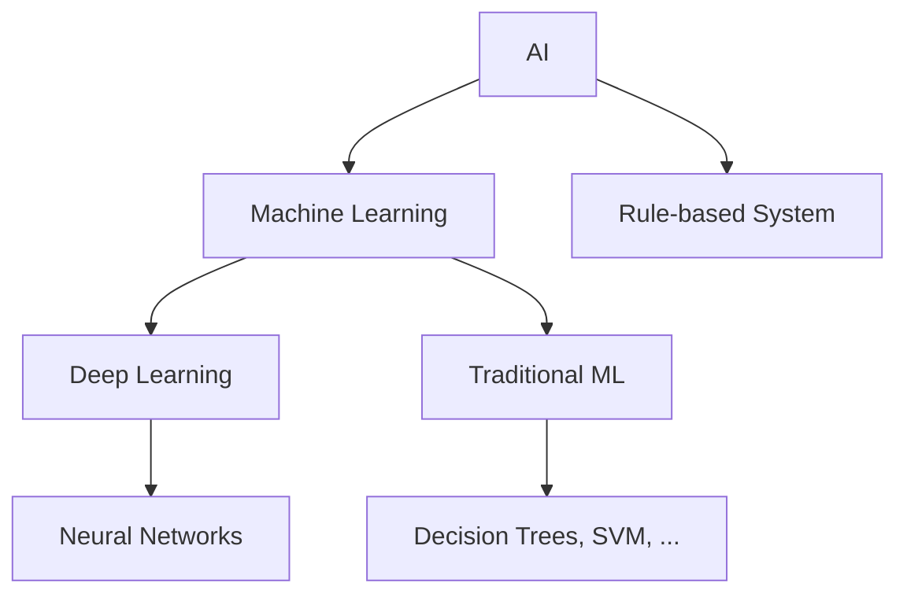
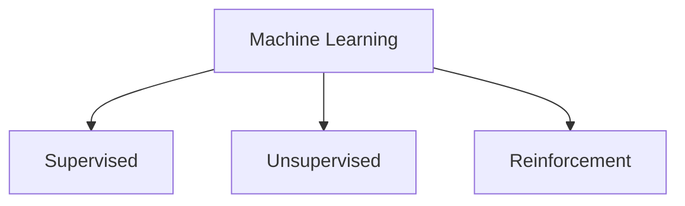
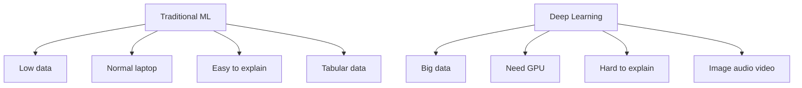

# Ngày 1: Hiểu về AI, Machine Learning và Deep Learning

## 1. AI (Trí tuệ nhân tạo) - Như một đứa trẻ thông minh

### AI là gì?
Hãy tưởng tượng bạn dạy một đứa trẻ nhận biết con mèo:
- Bạn chỉ cho trẻ nhiều hình ảnh con mèo
- Trẻ học cách nhận ra: "Có tai nhọn, có râu, kêu meo meo = con mèo"
- Sau đó trẻ có thể nhận biết mèo trong những hình ảnh mới

**AI cũng vậy** - máy tính học cách làm những việc thông minh như con người:
- **Siri hiểu khi bạn nói:** "Hôm nay thời tiết thế nào?"
- **Google Photos tự động gắn tag:** Nhận ra ai là ai trong ảnh
- **Xe tự lái:** Biết khi nào dừng, khi nào rẽ
- **ChatGPT trả lời câu hỏi:** Như một người bạn thông minh

#### Sơ đồ tổng quan về AI

*Chú thích:
- AI: Trí tuệ nhân tạo
- Machine Learning: Học máy
- Deep Learning: Học sâu
- Traditional ML: Học máy truyền thống
- Rule-based System: Hệ thống dựa trên luật
- Neural Networks: Mạng nơ-ron
- Decision Trees, SVM, ...: Các thuật toán truyền thống khác*

### Các loại AI
- **AI chuyên biệt:** Giỏi 1 việc (như Siri chỉ hiểu giọng nói, Google Translate chỉ dịch)
- **AI tổng quát:** Giỏi nhiều việc như con người (chưa có thật)
- **AI siêu thông minh:** Thông minh hơn con người (chỉ trong phim viễn tưởng)

---

## 2. Machine Learning - Như dạy máy tính từ kinh nghiệm

### Machine Learning là gì?
Giống như bạn học lái xe:
- **Lần đầu:** Bạn không biết gì, cần thầy dạy từng bước
- **Sau nhiều lần lái:** Bạn tự động biết khi nào phanh, khi nào tăng tốc
- **Kinh nghiệm:** Càng lái nhiều, càng lái giỏi

**Machine Learning cũng vậy** - máy tính học từ dữ liệu để đưa ra quyết định:

### 3 cách học chính:

#### Sơ đồ các loại học máy

*Chú thích:
- Supervised: Học có thầy
- Unsupervised: Học không thầy
- Reinforcement: Học tăng cường*

#### **Học có thầy (Supervised Learning)**
**Ví dụ đời thường:** Dạy trẻ nhận biết trái cây
- Bạn chỉ ảnh táo và nói: "Đây là táo"
- Chỉ ảnh cam và nói: "Đây là cam"
- Sau đó trẻ có thể nhận biết táo/cam trong ảnh mới

**Trong lập trình:**
- **Lọc email spam:** Dạy máy từ 1000 email đã được gắn nhãn "spam" hay "không spam"
- **Dự đoán giá nhà:** Cho máy xem 1000 căn nhà với diện tích, vị trí và giá thực tế
- **Nhận diện khuôn mặt:** Dạy máy từ 10000 ảnh có gắn tên người

#### **Học tự khám phá (Unsupervised Learning)**
**Ví dụ đời thường:** Phân loại bạn bè
- Bạn không nói trước nhóm nào
- Máy tự phát hiện: "Nhóm này thích thể thao, nhóm kia thích âm nhạc"
- Tự động chia thành các nhóm có sở thích giống nhau

**Trong lập trình:**
- **Phân nhóm khách hàng:** Tìm ra khách VIP, khách thường xuyên, khách mới
- **Phát hiện gian lận:** Tìm những giao dịch "lạ" so với bình thường
- **Phân tích xu hướng:** Tìm pattern trong dữ liệu bán hàng

#### **Học qua thử và sai (Reinforcement Learning)**
**Ví dụ đời thường:** Học chơi game
- Thắng → được điểm thưởng → nhớ cách chơi đó
- Thua → bị trừ điểm → tránh cách chơi đó
- Càng chơi nhiều, càng giỏi

**Trong lập trình:**
- **Robot dọn nhà:** Thử nhiều cách, nhớ cách nào hiệu quả nhất
- **Xe tự lái:** Học từ triệu km đường, nhớ cách xử lý từng tình huống
- **Trading bot:** Học từ thị trường, nhớ chiến lược nào có lãi

---

## 3. Deep Learning - Như bộ não con người

### Deep Learning là gì?
Hãy tưởng tượng bộ não bạn khi nhìn một bức ảnh:

**Bước 1:** Mắt thấy các đường nét, màu sắc
**Bước 2:** Não ghép các đường thành hình dạng  
**Bước 3:** Nhận ra đây là khuôn mặt
**Bước 4:** Nhận ra đây là mặt của ai

**Deep Learning cũng vậy** - nhiều lớp xử lý liên tiếp như não bộ:

#### Sơ đồ luồng xử lý của Deep Learning

*Chú thích: Deep Learning xử lý dữ liệu qua nhiều lớp liên tiếp, mỗi lớp trích xuất đặc trưng sâu hơn.*

### Tại sao gọi là "Deep" (Sâu)?
- **Shallow (Nông):** 1-2 lớp xử lý (như máy tính cũ)
- **Deep (Sâu):** 10-100+ lớp xử lý (như não người)
- Càng nhiều lớp, càng hiểu được patterns phức tạp

### Ví dụ thực tế:
- **Google Lens:** Chụp ảnh món ăn → nhận ra tên món + công thức
- **Shazam:** Nghe 5 giây nhạc → biết tên bài + ca sĩ  
- **Voice Assistant:** Nói tiếng Việt → hiểu ý nghĩa + trả lời
- **Tesla:** Nhìn đường → biết có người, xe, biển báo ở đâu

---

## 4. Generative AI - Máy tính sáng tạo như con người

### Generative AI là gì?
Trước đây, máy tính chỉ biết **phân loại và dự đoán**:
- "Đây có phải là mèo không?" → Trả lời Có/Không
- "Giá nhà này bao nhiêu?" → Trả lời con số

**Bây giờ, máy tính có thể SÁNG TẠO:**
- "Vẽ cho tôi một con mèo bay trên mây" → Tạo ra bức ảnh
- "Viết bài thơ về mùa thu" → Sáng tác thơ
- "Tạo nhạc buồn 3 phút" → Soạn nhạc mới

### Ví dụ Generative AI:
- **DALL-E, Midjourney:** Gõ mô tả → Ra ảnh đẹp
- **ChatGPT, Claude:** Hỏi gì cũng trả lời được  
- **Suno, Udio:** Mô tả → Tạo bài hát hoàn chỉnh
- **Runway, Pika, Gemini Veo 3:** Văn bản → Video ngắn
- **GitHub Copilot, Cursor AI:** Mô tả chức năng → Viết code tự động

---

## 5. So sánh: Máy tính thông minh vs Máy tính sáng tạo

### Hiểu đơn giản:

#### **Máy tính thông minh (Traditional ML)**
Như một **thám tử giỏi:**
- Xem bằng chứng → Kết luận ai là thủ phạm
- Xem triệu chứng → Chẩn đoán bệnh gì
- Xem lịch sử mua hàng → Dự đoán khách sẽ mua gì

**Đặc điểm:**
- Nhanh, chính xác với dữ liệu có sẵn
- Giải thích được tại sao ra kết quả đó
- Không cần máy tính mạnh
- Chỉ trả lời được câu hỏi đã học

#### **Máy tính sáng tạo (Deep Learning)**
Như một **nghệ sĩ tài năng:**
- Nhìn 1 triệu bức ảnh → Vẽ được ảnh mới
- Đọc 1 triệu cuốn sách → Viết được truyện mới  
- Nghe 1 triệu bài hát → Sáng tác được nhạc mới

**Đặc điểm:**
- Tạo ra được nội dung hoàn toàn mới
- Xử lý được ảnh, âm thanh, video phức tạp
- Càng nhiều dữ liệu càng giỏi
- Cần máy tính mạnh, tốn điện
- Khó giải thích tại sao ra kết quả đó

---

### Infographic: So sánh Traditional ML và Deep Learning

*Chú thích:
- Low data: Ít dữ liệu
- Normal laptop: Máy tính thường
- Easy to explain: Dễ giải thích
- Tabular data: Dữ liệu bảng
- Big data: Dữ liệu lớn
- Need GPU: Cần GPU
- Hard to explain: Khó giải thích
- Image audio video: Xử lý ảnh, âm thanh, video*

### **Khi nào dùng Traditional ML:**
**Tình huống:** Bạn là chủ cửa hàng nhỏ
- Dự đoán doanh thu tháng tới (dựa trên lịch sử bán hàng)
- Phân loại khách hàng (VIP, thường, mới)
- Lọc email spam (dựa trên từ khóa)
- Định giá sản phẩm (dựa trên đặc điểm)

**Lý do:** Dữ liệu ít, cần hiểu tại sao, máy tính bình thường

### **Khi nào dùng Deep Learning:**
**Tình huống:** Bạn làm app lớn như TikTok
- Nhận diện khuôn mặt trong video
- Tạo nhạc nền tự động  
- Chatbot thông minh trả lời mọi câu hỏi
- Tạo filter AR cho camera

**Lý do:** Dữ liệu khổng lồ, cần tính năng wow, có máy mạnh

---

## 7. Xu hướng AI hiện tại (cho lập trình viên)

### **Những gì đang HOT:**
- **AI Coding Assistant:** Cursor AI, GitHub Copilot - viết code tự động
- **ChatGPT cho dev:** Giải thích code, debug, tạo test case
- **AI tạo UI:** Figma to Code, v0.dev - từ design thành code
- **AI phân tích data:** Tự động tạo dashboard, báo cáo

### **Tương lai gần (1-2 năm tới):**
- **AI viết app hoàn chỉnh:** Chỉ cần mô tả, AI code toàn bộ
- **AI tự test và fix bug:** Không cần QA manual
- **AI deploy tự động:** Từ code đến production không cần DevOps

---

## 8. Lời khuyên cho lập trình viên

### **Nên làm ngay:**
1. **Học dùng AI tools:** Cursor AI, ChatGPT, GitHub Copilot
2. **Thử nghiệm:** Dùng AI để viết code, giải thích bug
3. **Hiểu cơ bản:** Biết khi nào dùng Traditional ML vs Deep Learning
4. **Cập nhật xu hướng:** Follow AI news, thử tools mới

### **Đừng lo lắng:**
1. **AI thay thế dev:** AI là tool hỗ trợ, không thay thế
2. **Phải học hết:** Chỉ cần hiểu cơ bản và biết dùng
3. **Phải làm AI engineer:** Dev bình thường cũng dùng AI được

### **Key takeaway:**
> **"AI không thay thế lập trình viên, nhưng lập trình viên biết dùng AI sẽ thay thế lập trình viên không biết dùng AI"**

---

## 9. Tài liệu học thêm (dễ hiểu)

### **Sách dễ đọc:**
- "AI for People in a Hurry" - Neil Reddy
- "Weapons of Math Destruction" - Cathy O'Neil

### **Video YouTube:**
- 3Blue1Brown - Neural Networks
- Fireship - AI in 100 seconds

### **Tools để thử:**
- **ChatGPT:** chat.openai.com
- **Cursor AI:** cursor.sh  
- **Google Colab:** colab.research.google.com (free GPU)

**Bắt đầu từ đây, học dần dần!** 